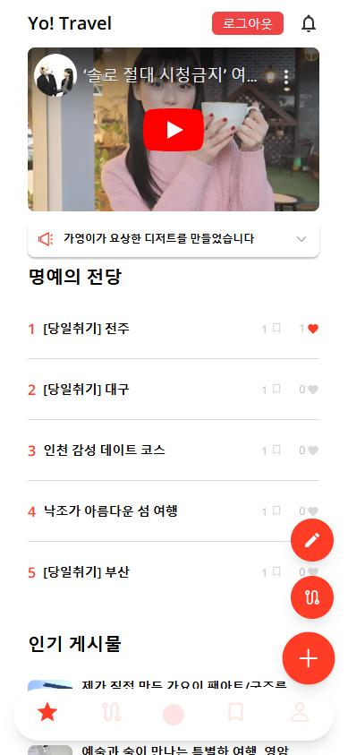
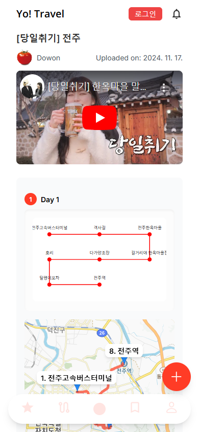
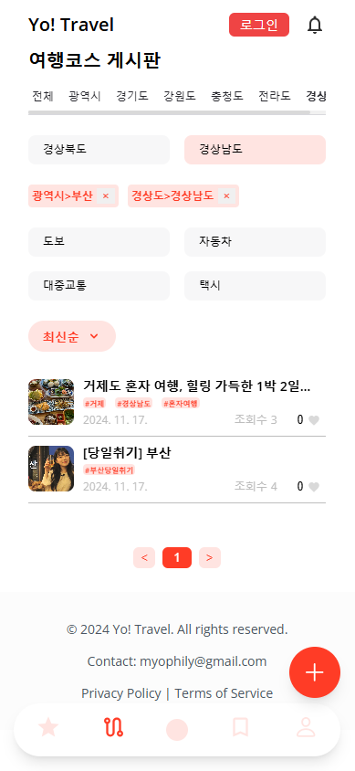
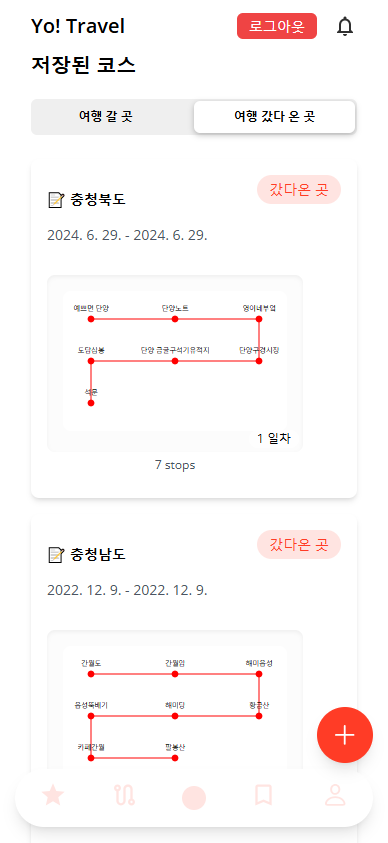
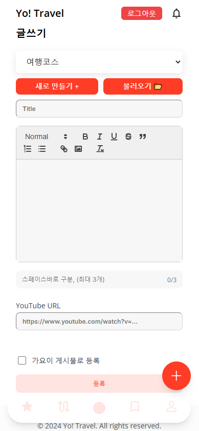
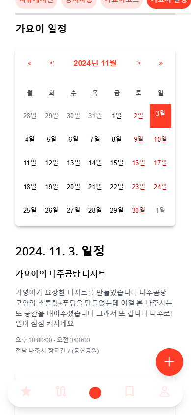

# Yo! Travel


A modern, mobile-first travel planning and community platform built with Next.js that helps users plan trips, share travel experiences, and discover new destinations across Korea with an intuitive interface and interactive maps.

## 🚀 Live Demo

> **Coming Soon!** This project will be deployed to Vercel.
>
> To deploy your own instance: [](https://vercel.com/new/clone?repository-url=https://github.com/Myophily/yo-travel-showcase)

## 📖 About This Project

Yo! Travel is a comprehensive Korean travel platform that combines detailed itinerary planning with social sharing features. Born from the need to simplify travel planning while fostering a community of travelers, this application allows users to:

- **Plan** detailed multi-day trips with interactive maps
- **Share** travel experiences through rich blog posts
- **Discover** curated travel content and top-rated destinations
- **Connect** with other travelers through a community feed

This project showcases modern web development practices including server-side rendering, real-time database operations, OAuth authentication, and interactive map integrations - all optimized for Korean users and locations.

## ✨ Features

### 🗺️ Travel Planning & Visualization

- **Multi-Day Itineraries**: Create detailed travel courses with multiple destinations per day
- **Interactive Kakao Maps**: Real-time route calculation with custom markers and transportation options
- **Place Search**: Search Korean locations using integrated Kakao Maps API
- **Visual Route Display**: See your journey with optimized paths and distance calculations
- **Date Selection**: Interactive calendar for planning future trips or recording past travels

### 📝 Community & Content Sharing

- **Rich Blog Posts**: Create travel stories with a full-featured Quill editor
- **Image Uploads**: Share photos with optimized Supabase storage integration
- **Social Interactions**: Like, save, and comment on posts from other travelers
- **User Profiles**: Customize your profile with bio and avatar
- **Following System**: Connect with and follow other travelers
- **Hall of Fame**: Discover top-rated travel courses from the community

### 🏆 Special Features

- **Yoiki Section**: Curated seasonal travel content with YouTube integration
- **Best Posts**: Algorithm-based trending content using engagement scoring
- **Search & Filters**: Advanced filtering by region, city, transportation type, and more
- **Real-time Updates**: Live post interactions and comment sections
- **Mobile-First Design**: Fully responsive interface optimized for mobile devices

## Tech Stack

- **Frontend**: Next.js 14, React 18
- **Styling**: Tailwind CSS
- **Authentication**: Supabase Auth (Google OAuth, Kakao OAuth)
- **Database & Storage**: Supabase
- **Maps**: Kakao Maps API
- **Rich Text Editor**: React Quill
- **Additional Libraries**:
  - React Calendar
  - React Markdown
  - DOMPurify (for sanitizing HTML)
  - html2canvas (for screenshot functionality)
  - Turndown (Markdown conversion)

## Prerequisites

Before you begin, ensure you have the following:

- Node.js 16.x or higher installed
- A Supabase account and project ([Create one here](https://supabase.com))
- Kakao Maps API keys ([Get them here](https://developers.kakao.com/))

## Getting Started

### 1. Clone the repository

```bash
git clone https://github.com/Myophily/yo-travel-showcase.git
cd yo-travel-showcase
```

### 2. Install dependencies

```bash
npm install
# or
yarn install
# or
pnpm install
```

### 3. Set up environment variables

Create a `.env.local` file in the root directory and add your environment variables:

```bash
# Copy the example file
cp .env.example .env.local
```

Then edit `.env.local` with your actual credentials:

```env
# Supabase Configuration
NEXT_PUBLIC_SUPABASE_URL=https://your-project-id.supabase.co
NEXT_PUBLIC_SUPABASE_ANON_KEY=your-supabase-anon-key-here

# Kakao Maps API Keys
NEXT_PUBLIC_KAKAO_JAVASCRIPT_APP_KEY=your-kakao-javascript-app-key-here
KAKAO_REST_API_KEY=your-kakao-rest-api-key-here
```

#### How to get your API keys:

**Supabase:**

1. Go to [Supabase Dashboard](https://app.supabase.com/)
2. Select your project
3. Go to Settings → API
4. Copy your Project URL and anon/public key

**Kakao Maps:**

1. Go to [Kakao Developers](https://developers.kakao.com/)
2. Create a new application
3. Go to your app settings
4. Navigate to "App Keys" section
5. Copy both JavaScript key and REST API key

> **🔒 Security Note**:
>
> - The `KAKAO_REST_API_KEY` is securely handled through a server-side API route (`/pages/api/kakao/directions.js`) and is never exposed to the client.
> - All Kakao Mobility API calls are proxied through the Next.js backend to protect your secret keys.
> - Never commit your `.env.local` file to version control - it's already listed in `.gitignore`.

### 4. Run the development server

```bash
npm run dev
# or
yarn dev
# or
pnpm dev
```

Open [http://localhost:3000](http://localhost:3000) with your browser to see the application.

## Building for Production

```bash
npm run build
npm start
```

## Project Structure

```
yo-travel-showcase/
├── components/         # React components
│   ├── Header.js
│   ├── Footer.js
│   ├── TripMap.js     # Map component with route visualization
│   ├── PlaceSearch.js # Location search component
│   └── ...
├── pages/             # Next.js pages
│   ├── api/           # API routes (server-side)
│   │   └── kakao/
│   │       └── directions.js  # Secure proxy for Kakao Mobility API
│   ├── index.js       # Home page
│   ├── login.js       # Authentication page
│   ├── _app.js        # App wrapper
│   └── _document.js   # Document wrapper
├── utils/             # Utility functions
│   ├── supabase.js    # Supabase client setup
│   └── imageUtils.js  # Image processing utilities
├── styles/            # Global styles and CSS
└── public/            # Static assets
```

## Deployment

This application can be easily deployed to Vercel:

[](https://vercel.com/new/clone?repository-url=https://github.com/Myophily/yo-travel-showcase)

Remember to add all environment variables in your Vercel project settings.

## Features in Detail

### Trip Management

- Create, edit, and delete trips
- Add multiple destinations to each trip
- Set trip dates using an interactive calendar
- Organize trips chronologically

### Map Integration

- Interactive Kakao Maps showing all destinations
- Automatic route calculation between multiple points
- Custom markers with location names
- Visual route display with optimized paths

### Authentication

- Secure OAuth authentication
- Support for Google and Kakao login
- Persistent user sessions
- Protected routes

## 📸 Screenshots









## 💡 Key Learning Outcomes

Through building this project, I gained hands-on experience with:

- **Next.js 14 & React 18**: Leveraging server-side rendering, API routes, and modern React patterns
- **Database Design**: Structuring relational data in Supabase with efficient queries and RLS policies
- **OAuth Authentication**: Implementing secure authentication flows with multiple providers
- **API Integration**: Working with third-party APIs (Kakao Maps) and handling rate limits
- **State Management**: Managing complex application state without external libraries
- **Performance Optimization**: Implementing pagination, lazy loading, and image optimization
- **Responsive Design**: Building mobile-first interfaces with Tailwind CSS
- **Error Handling**: Implementing robust error boundaries and user-friendly error messages

---

Made by Myophily, Assisted by Claude Sonnet 3.5, 2024
